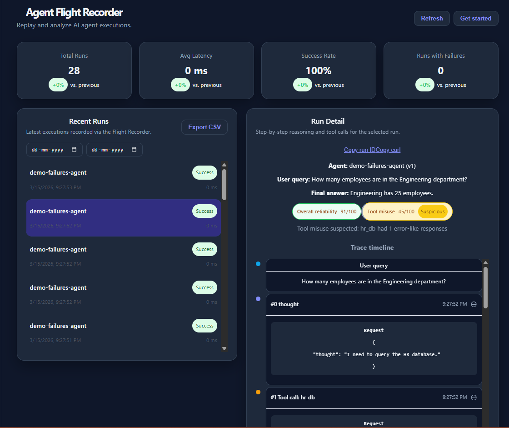
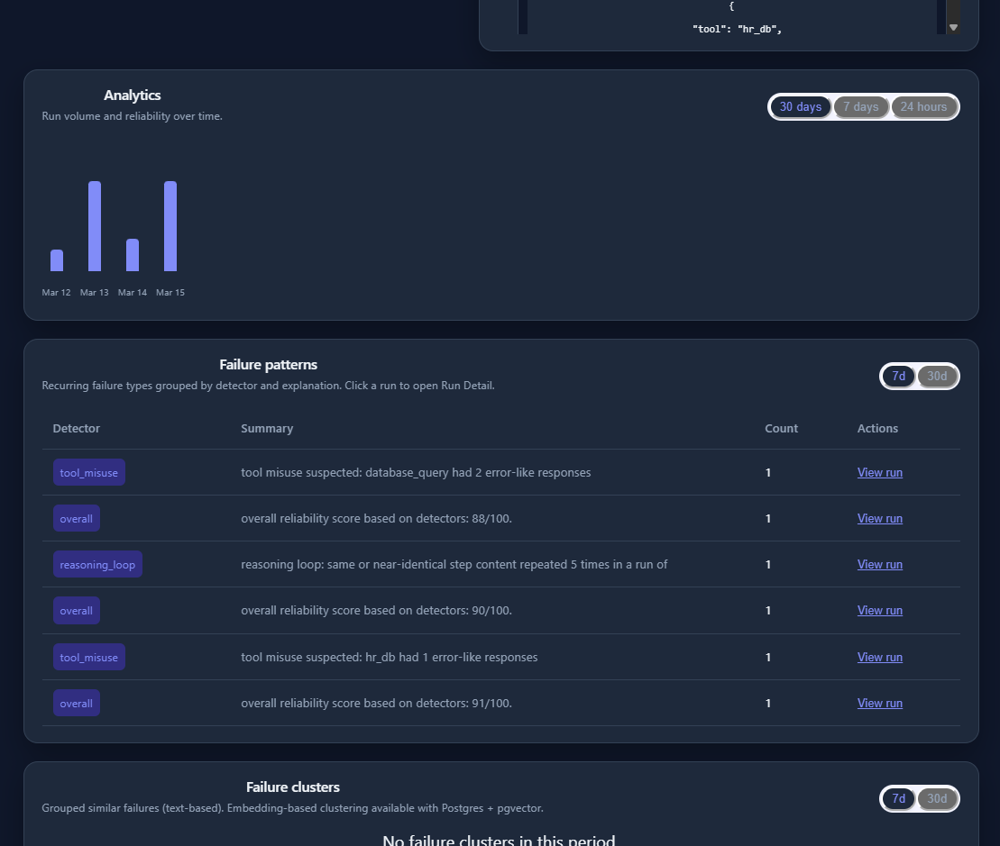
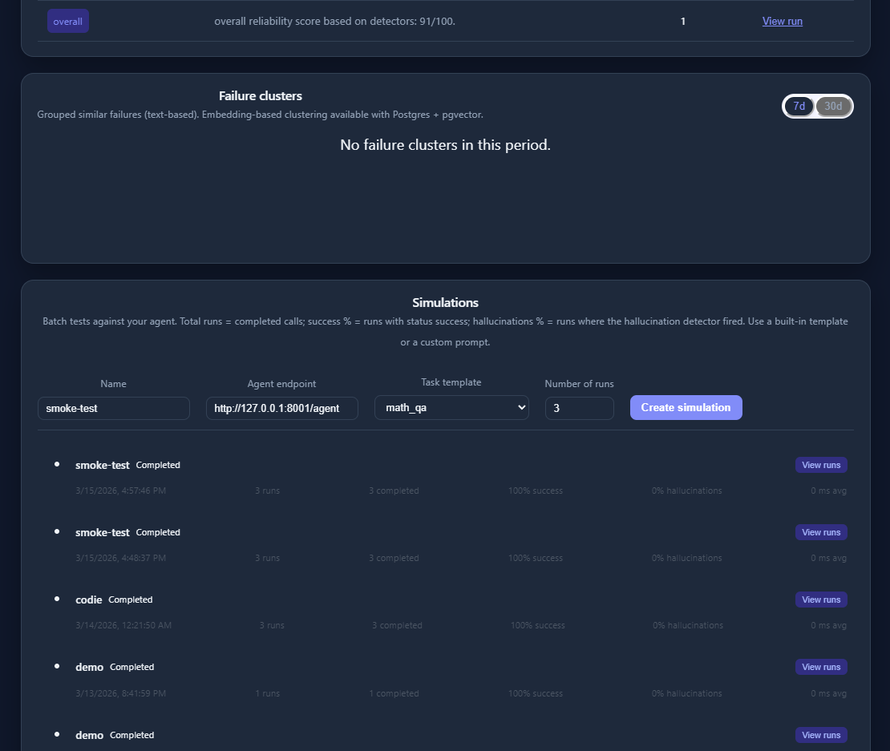
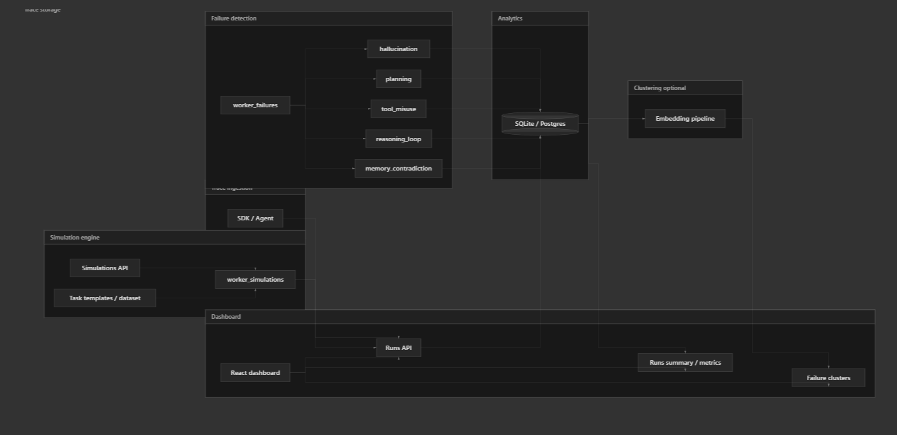

# Agent Flight Recorder

Record AI agent runs, detect failures, run batch simulations, and inspect everything in one dashboard.

---

## Problem

AI agents fail in subtle ways: hallucinations, bad reasoning, tool misuse, planning errors, and contradictions. Without a recorder you can't replay runs, compare behavior, or spot patterns. Debugging becomes guesswork and you have no visibility into how often things go wrong in production.

---

## Solution

Agent Flight Recorder gives you a single place to:

- **Record** every agent run (query, steps, tool calls, final answer) via a small SDK or HTTP API.
- **Detect** failures automatically with five detectors: hallucination, planning failure, tool misuse, reasoning loop, and memory contradiction.
- **Simulate** batch tests against your agent endpoint and see success, hallucination, and tool-error rates.
- **Inspect** runs in a dashboard: replay steps, view reliability scores, analytics over time, failure patterns, and clusters.

---

## Features

- **Trace ingestion** — `POST /api/v1/runs` stores runs and steps (SDK or raw HTTP).
- **Failure detection** — Background worker runs five detectors; per-run scores appear in the UI (hallucination, planning, tool_misuse, reasoning_loop, memory_contradiction).
- **Simulations** — Create jobs with built-in templates (math_qa, doc_qa, multi_turn, code_assist), a **custom prompt**, or a **task dataset**; metrics include success_rate, hallucination_rate, tool_error_rate, avg_latency_ms.
- **Task datasets** — Create named prompt sets via `POST /api/v1/datasets` and attach to simulations.
- **Dashboard** — Recent runs, run detail with trace timeline and failure pills, analytics chart (including per-detector rates), failure patterns, failure clusters, simulation list and filtering.
- **Auth & limits** — Optional API key on write endpoints; per-IP rate limits.

**Demo:** To fill the dashboard with intentional failures for a demo, run **`python backend/demo_intentional_failures.py`** (set `FLIGHT_RECORDER_API_KEY` if your API requires auth).

---

## Dashboard Screenshot

The dashboard shows metrics, recent runs with reliability and failure indicators, run detail with a step-by-step trace timeline, analytics over time, failure patterns, and simulation management.

| Overview & run detail | Analytics & failure patterns |
|----------------------|------------------------------|
|  |  |

*Metrics (total runs, latency, success rate, runs with failures), recent runs list, run detail with trace timeline and detector scores (e.g. tool misuse), and the simulations form.*



*Failure clusters (grouped similar failures) and simulations: create jobs with templates or custom prompts, view completed runs and success/hallucination rates.*

**How to add these screenshots:** Put your image files in the `assets/` folder at the repo root with these exact names: `screenshot-overview.png`, `screenshot-analytics.png`, `screenshot-simulations.png`. Then commit and push (see end of README).

---

## Architecture

High-level flow: agents (via SDK) send runs to the API; the failure worker categorizes them (hallucination, planning, tool misuse, reasoning loop, memory contradiction); analytics are stored in SQLite/Postgres with optional embedding-based clustering; the simulation engine runs batch tests from templates or datasets; the dashboard reads from the API to show runs, metrics, and failure patterns.



Failure detection → Analytics (SQLite/Postgres, optional clustering) → Simulation engine (API + worker + templates) → Dashboard (API + React).

**Repo layout:**

```
backend/           # FastAPI app, workers, SDK, demo agent
  app/
    routes/        # runs, simulations, analytics, detectors, datasets, failure_patterns, failure_clusters
    detectors/     # hallucination, planning, tool_misuse, reasoning_loop, memory_contradiction
    deps/          # auth, rate_limit
  sdk_flight_recorder.py
  simple_agent_api.py
  demo_intentional_failures.py
frontend/          # Vite + React dashboard
```

- **API** — Ingests runs, serves runs/analytics/patterns/clusters, creates simulations and datasets.
- **Workers** — `worker_failures` processes runs with detectors; `worker_simulations` runs simulation jobs against agent endpoints.
- **Dashboard** — React app for listing runs, viewing run detail (trace timeline, failures), analytics charts, failure patterns/clusters, and simulations.

---

## Installation

1. **Clone the repo**
   ```bash
   git clone https://github.com/areeb24111/Ai-Agent-flight-recorder.git
   cd Ai-Agent-flight-recorder
   ```

2. **Backend** (Python 3.10+)
   ```bash
   cd backend
   pip install -r requirements.txt
   cp .env.example .env   # edit .env: optional API_KEY, OPENAI_API_KEY for detectors
   ```

3. **Frontend**
   ```bash
   cd frontend
   npm install
   ```

4. **Optional:** Configure `backend/.env` with `API_KEY` (if you want to protect write endpoints) and `OPENAI_API_KEY` (for stronger hallucination/planning/memory-contradiction detection).

---

## Usage

### Local (one-command start)

From the **repo root**:

- **Windows:** `.\scripts\start.ps1 -IncludeFrontend`
- **Mac/Linux:** `python scripts/start_all.py --frontend`

Then open **http://localhost:5173**. To ingest a run and verify the flow, see [docs/TESTING.md](docs/TESTING.md).

### Manual run (four terminals)

1. **API:** `cd backend && uvicorn app.main:app --reload --port 8000`
2. **Failure worker:** `cd backend && python -m app.worker_failures`
3. **Simulation worker:** `cd backend && python -m app.worker_simulations`
4. **Frontend:** `cd frontend && npm run dev`
5. **Optional demo agent:** `cd backend && uvicorn simple_agent_api:app --port 8001`

### Ingest a run

- **SDK:** See `backend/send_test_run.py` and `backend/sdk_flight_recorder.py`.
- **curl:**
  ```bash
  curl -X POST http://127.0.0.1:8000/api/v1/runs \
    -H "Content-Type: application/json" \
    -d '{"agent_id":"my-agent","user_query":"What is 2+2?","final_answer":"4","latency_ms":100,"steps":[]}'
  ```
- If the API requires an API key: add `-H "X-API-Key: YOUR_API_KEY"`.

**Deploy online:** Connect the repo to Render, Railway, or Google Cloud Run; set env vars (e.g. `DATABASE_URL`, `OPENAI_API_KEY`, `API_KEY`). Run the API and workers (see Manual run).  
**Share with others:** Give them your dashboard URL and API URL; they send runs via `POST /api/v1/runs` (or the SDK) and view results in your dashboard.

---

## Simulation Testing

Create simulation jobs that call your agent endpoint repeatedly and record each run:

1. In the dashboard, use the **Simulations** section: set name, agent endpoint (e.g. `http://127.0.0.1:8001/agent` for the demo agent), task template (e.g. `math_qa`, `doc_qa`, or **custom** with your own prompt), and number of runs.
2. Click **Create simulation**. The simulation worker will POST each task to your agent; runs appear under **Recent runs**. Filter by simulation via **View runs**.
3. **API:** `POST /api/v1/simulations` with `name`, `agent_endpoint`, `task_template`, `num_runs`, and optionally `template_config: { "query": "..." }` for a custom prompt or `dataset_id` for a task dataset.

Metrics shown: total runs, completed, success %, hallucination %, tool error %, avg latency.

---

## Roadmap

Planned: trace timeline UI, failure badges, embedding-based clustering, optional Postgres + pgvector. See CHANGELOG for release history.

---

## API summary

| Method | Path | Auth | Description |
|--------|------|------|-------------|
| GET | `/health` | no | Liveness |
| POST | `/api/v1/runs` | if `API_KEY` set | Ingest run + steps |
| GET | `/api/v1/runs` | no | List runs (filters: simulation_id, agent_id, date_from, date_to, offset, limit) |
| GET | `/api/v1/runs/agents` | no | List distinct agent IDs |
| GET | `/api/v1/runs/export?format=csv\|json` | no | Export runs |
| GET | `/api/v1/runs/{id}` | no | Run detail + failures |
| POST | `/api/v1/simulations` | if `API_KEY` set | Create simulation (optional `template_config`, `dataset_id`) |
| GET | `/api/v1/simulations` | no | List simulations |
| GET | `/api/v1/analytics/runs_summary?days=N&by_detector=true` | no | Runs/day, rates, avg_latency_ms |
| GET | `/api/v1/detectors` | no | List detectors and default thresholds |
| POST | `/api/v1/datasets` | if `API_KEY` set | Create task dataset |
| GET | `/api/v1/datasets` | no | List datasets |
| GET | `/api/v1/failure_patterns?days=N` | no | Failure patterns by detector + explanation |
| GET | `/api/v1/failure_clusters?days=N` | no | Failure clusters (text-based; pgvector later) |

---

## Contributing

Contributions are welcome: open an issue or submit a pull request. For larger changes, open an issue first to align on design.

---

## License

Proprietary — adjust as needed for your use.
